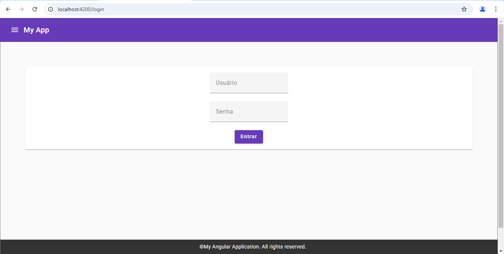
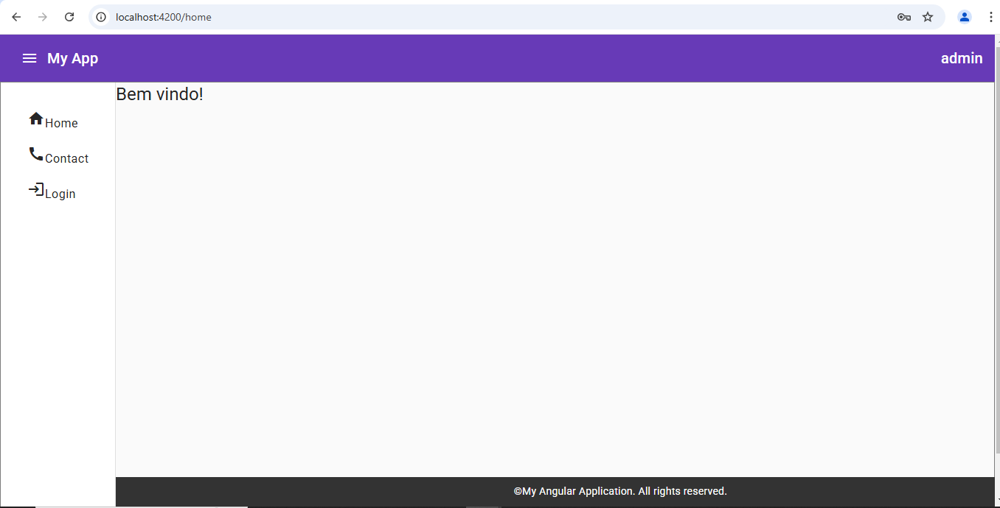

# **Página Web Angular - Iatec Academy**

Este projeto foi desenvolvido pelo curso de Angular da **Iatec Academy**, utilizando o framework **Angular 16**. A aplicação é uma página web com telas de **login**, **home** e **contato**, que utiliza **Angular Material** para um design moderno e responsivo. O projeto também utiliza **componentes**, **shared services** e **RxJS** para facilitar a organização e reutilização do código.

---

## 🛠 **Tecnologias Utilizadas**

- **Angular 16**: Framework para construção de interfaces ricas e dinâmicas.
- **Angular Material**: Biblioteca de componentes com design responsivo e moderno.
- **TypeScript**: Linguagem usada para desenvolvimento.
- **HTML5 & CSS3**: Para estruturação e estilo da interface.
- **RxJS**: Biblioteca para programação reativa.

---
# **Página Web Angular - Iatec Academy**

Este projeto foi desenvolvido para a **Iatec Academy**, utilizando o framework **Angular 16**.

---

## 📸 **Demonstração**

Aqui estão algumas capturas de tela da aplicação:

---

## 🌟 **Funcionalidades**

### 1. **Tela de Login**
A aplicação possui uma tela de login onde os usuários podem inserir suas credenciais para acessar a aplicação.

### 2. **Tela Home**
Após o login bem-sucedido, o usuário é direcionado para a tela inicial (home) da aplicação.

### 3. **Tela de Contato**
A aplicação conta com uma tela de contato onde os usuários podem preencher um formulário com seus dados.

---

## 🛠 **Tecnologias Utilizadas**

- **Angular 16**
- **Angular Material**
- **TypeScript**
- **HTML5 & CSS3**
- **RxJS**

  
  
  
  
  
  
  

---
## 🙏 **Agradecimentos**

Gostaria de expressar minha profunda gratidão à **Iatec Academy** pela excelente formação em Angular. O curso foi fundamental para o desenvolvimento deste projeto, e todo o conhecimento adquirido foi crucial para a implementação das funcionalidades e boas práticas aplicadas aqui.

A **Iatec Academy** se destacou pelo conteúdo de alta qualidade, pela didática envolvente e pelo apoio constante ao longo do aprendizado. Agradeço aos instrutores, mentores e a toda a equipe que torna possível essa experiência educacional.

---

Se você também está interessado em aprender **Angular** ou outras tecnologias, recomendo fortemente o curso oferecido pela **Iatec Academy**!

